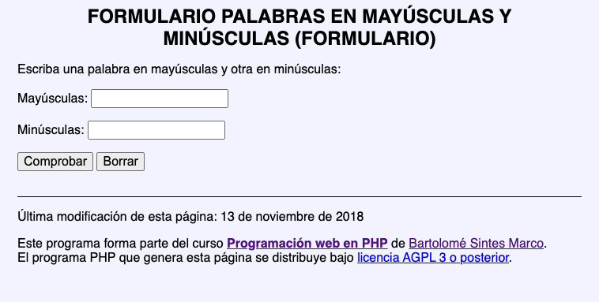
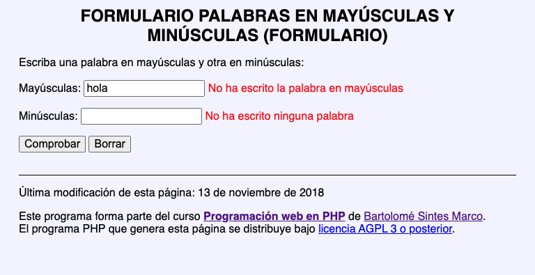
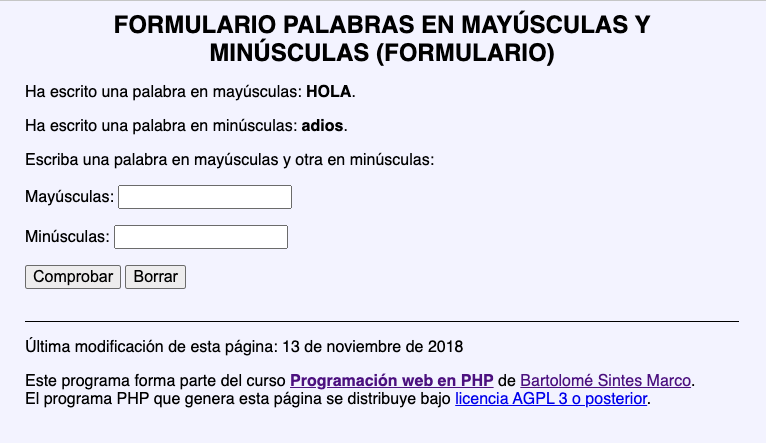

## 01 MAYÚSCULAS Y MINÚSCULA

Escriba un programa de dos páginas. En la primera, hacer un **formulario** con dos campos donde debemos introducir texto en mayúsculas y texto en minúsculas. En caso de error (no haber escrito nada o haber escrito texto con el formato incorrecto), mostraremos un mensaje.

- El programa detecte si se ha escrito o no una única palabra en mayúsculas
- La primera página muestre mensajes de error, cuando la segunda página detecte un error.
- La primera página incluya en el control el valor incorrecto escrito por el usuario, cuando la segunda página detecte un error.

Es decir, hay que hacer el ejercicio unsado 2 archivos. La comproblación de datos se hará en el segundo archivo y la vista de los datos se hará en el primero.

Usaremos variables de sesión para compartir información, por ejemplo, los mensajes de error en caso de que existan.

