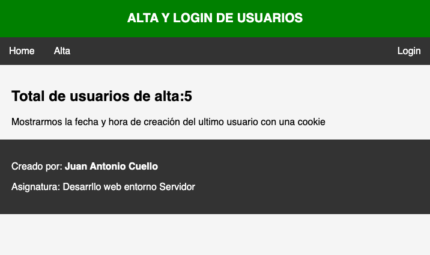
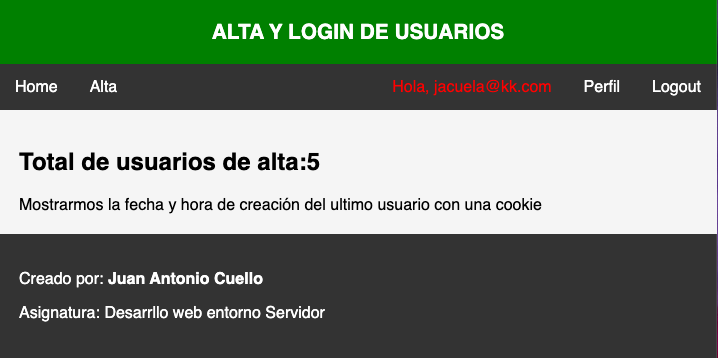
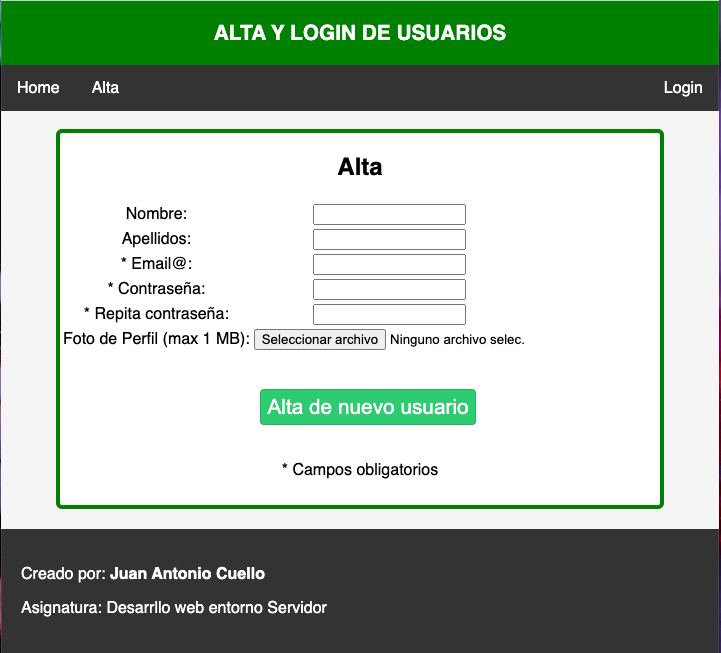
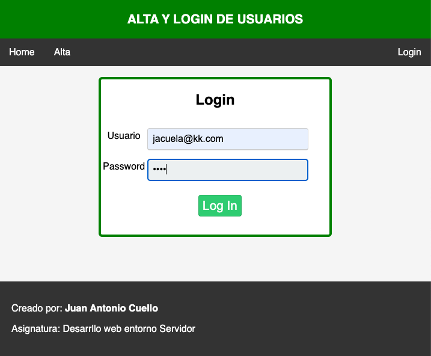
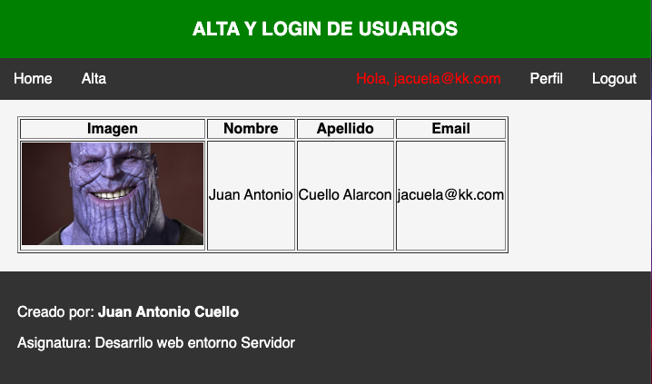
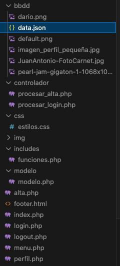

## 4 MENUS

Partiendo del ejercicio anterior, donde nos creamos la funcionanidad para el alta de usuario y el login de usuario, vamos a incluir un menú y un footer, creando una aplicación con cierta coherencia.

El menú y el footer serán archivos independientes, y lo que haremos, será incluirlos donde queramos. De esta forma, si hacemos algíun cambio en el menu o el footer, solo tendremos que hacerlo en un único archivo.

Además, vamos a reorganizar las carpetas de mi proyecto, para que sea más acorde a como lo hace un framework. Estará todo más ordenado. En realidad, este orden es algo opcional, pero es una buena práctica de cara a un futuro mantenimiento.

**Otras tareas**

- Vamos a aprender a crearnos una cookie para guardar información en el lado del cliente. En este caso, indicaremos en la pantalla principal, nombre, la fecha y hora de creación del ultimo usuario.
- Almaceranemos la constraseña cifrada, usando la funcion *password_hash()* para encriptarla y *password_verify()* para desencriptarla.

 

Al loguearnos, nos aparecerá la opción de perfil, el nombre del usuario, y logout, desaparaciendo login,

Vista del perfil de usuario

Estructura de carpetas del proyecto

