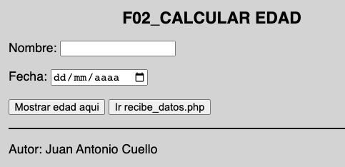
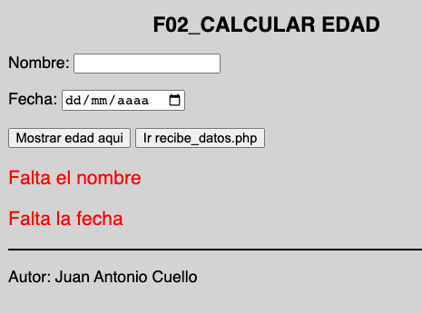
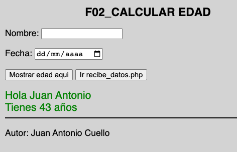
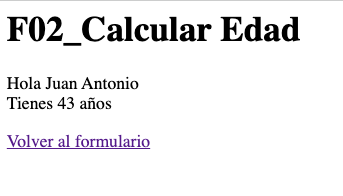

## 02 CALCULAR EDAD

Hacer un formulario que te pida el nombre y la fecha de nacimiento y te salude y te calcule tu edad.

Tdendrá dos botones, uno para mostrar los datos en el mismo formulario y otro para pasarle los datos a otro archivo, al backend

Al pulsar cualquiera de los dos botones, si no he instroducido algun dato, nos mostrara el error en el mismo formulario.

_Si hay errores, los muestro en el mismo form_

_Aqui muestro los datos en el mismo form_

_Aqui muestro los datos en otro archivo_

