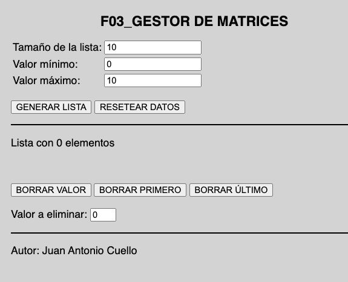
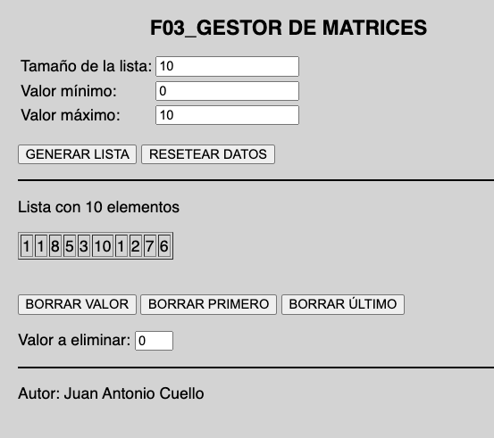
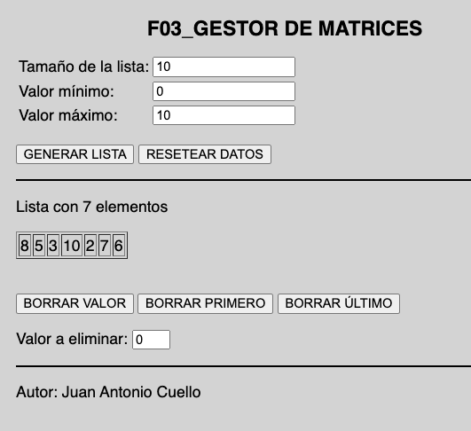

## 03 GESTOR DE MATRICES

Hacer un formulario para crear y modificar una lista simple de valores numéricos. 




- **GENERAR LISTA**: genera una nueva lista con los parámetros escogifos
- **RESETEAR DATOS**: resetea los parámetros
- **BORRAR VALOR**: borra de la lista todas las aparicones del elemento indicado en el cuadro de texto _Valor a eliminar_
- **BORRAR PRIMERO**: borra el primer elemento
- **BORRAR ÚLTIMO**: borra el último elemento


_Al pulsar en GENERAR, se crea la lista con el tamaño escogifo_


_Despues de haber borrado el valor 1_



DIFICULTAD ENCONTRADA: Para hacer este ejercicio, debido a que no se preservan las variables entre llamadas POST/GET, al generar una lista, hay que pasarla como si fuera un dato más del formulario como un parámetro oculto.

```php
//###### IMPORTANTE. SINO, NO SE PUEDE HACER (A MENOS QUE SE USEN VARIABLES DE SESION)
//Preservar la lista entre llamadas POST usando campo HIDDEN
foreach ($lista as $value) {
  echo '<input type="hidden" name="listaOculta[]" value="' . $value . '">';
}

```

NOTA: ojo si usas funciones que llamen a parámetros de ambito global. En PHP, hay que usar la palabra _global_ dentro de una función para usar una variable de ambito global en el archivo.


```PHP
function rellenar_lista($tam, $min, $max)
{
  global $lista;  //variable de ambito global.
  $lista = []; //la inicializo a vacio, por si ya tuviera valores
  for ($i = 0; $i < $tam; $i++) {
    $lista[] = rand($min, $max);
  }
}

```