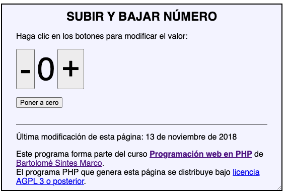
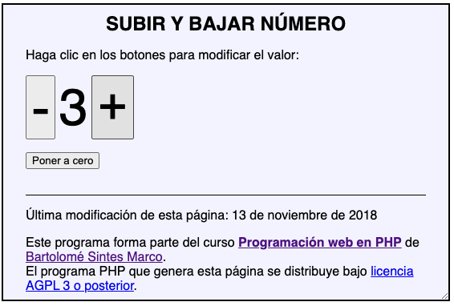

## 01 BOTÓN MAS Y MENOS

Escriba un programa de dos páginas que muestre un valor numérico y permita subirlo o bajarlo mediante dos botones.

- La primera página contiene un formulario con tres botones de tipo submit con el mismo name.
- La segunda página recibe el dato, modifica el número y redirige a la primera página.
- El número se guarda en una variable de sesión. Si la variable no está definida, se le dará el valor 0.

